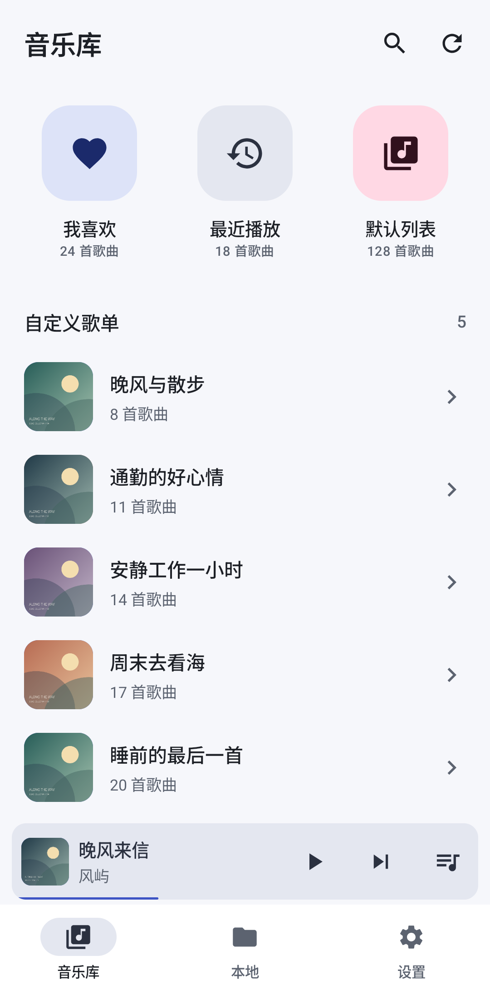
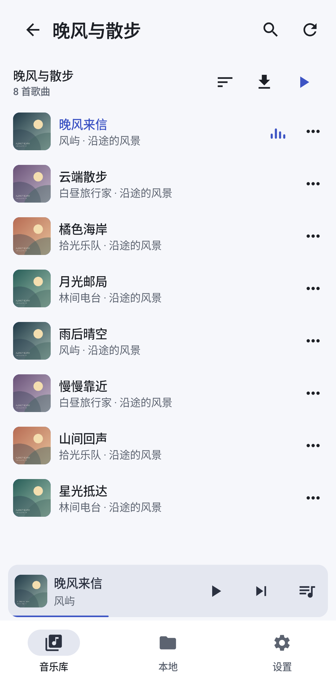
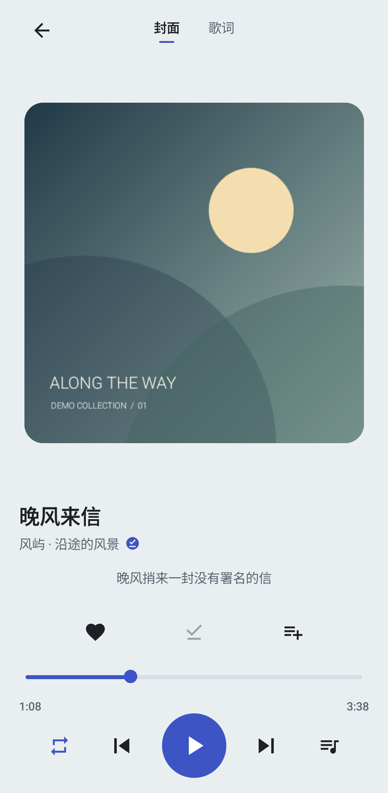
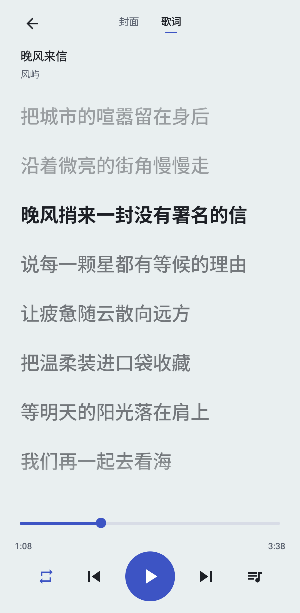
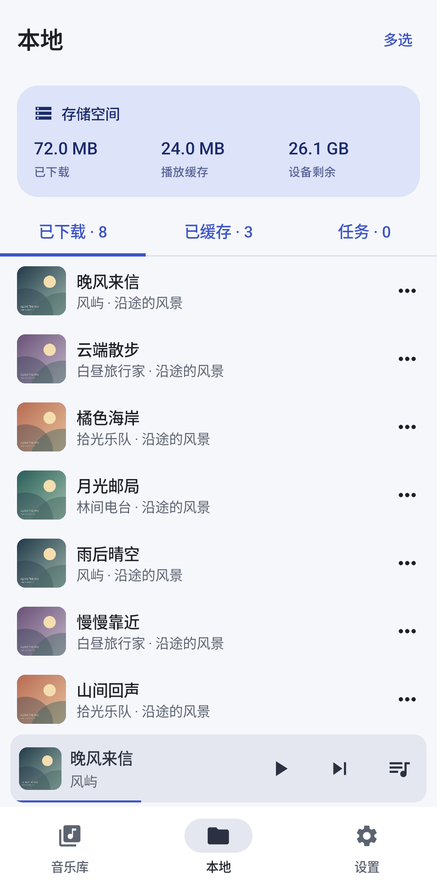
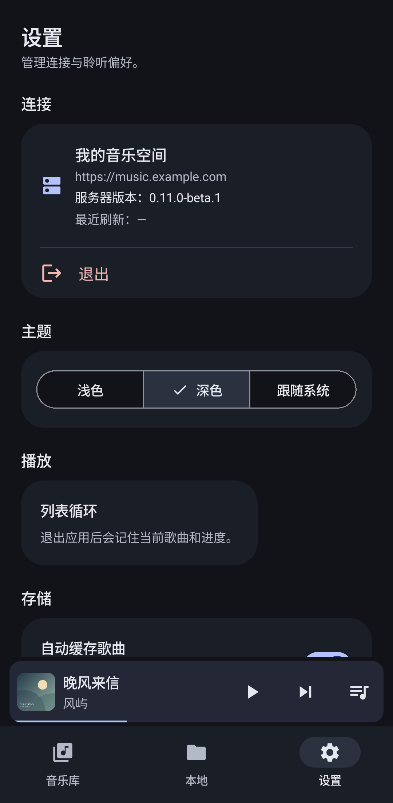

# Any Listen Android · 非官方客户端

这是作者主要为自用开发的 Android 客户端，围绕**使用自建 [Any Listen Web Server](https://github.com/any-listen/any-listen-web-server) 管理个人本地音乐文件**这一场景，方便在手机上浏览音乐库、播放歌曲、查看歌词，以及下载后离线收听。

音乐文件由 Any Listen 服务端管理，客户端连接服务端使用这些资源，并保存需要离线收听的副本。功能取舍和维护节奏以作者的实际使用需求为主，公开源码供有相似需求的用户使用和交流。

> 本项目由作者独立开发和维护，**不是 Any Listen 官方客户端**，与官方团队不存在隶属或背书关系。应用图标来自上游，仅用于说明来源与兼容性。

## 界面预览

以下为应用实际界面，全部使用**虚拟歌曲、歌手、歌单、歌词、存储数据及示例服务器地址**。封面为本项目绘制的演示图，不包含私人音乐库或真实账号信息。

| 音乐库 | 歌曲清单 | 正在播放 |
| :---: | :---: | :---: |
|  |  |  |

| 全屏歌词 | 本地音乐 | 深色主题 |
| :---: | :---: | :---: |
|  |  |  |

## 功能

| 模块 | 已实现能力 |
| --- | --- |
| 音乐库 | 我喜欢、最近播放、默认列表快捷入口，自定义歌单列表；搜索已同步的跨歌单曲目 |
| 歌曲操作 | 播放、稍后播放、管理队列；联网时收藏及向可修改歌单添加、移除歌曲 |
| 播放 | 后台播放、系统媒体通知、顺序/随机/循环模式，重启恢复当前歌曲和进度 |
| 封面与歌词 | 左右滑动切换封面与全屏歌词，封面页显示当前歌词；封面与歌词默认缓存 |
| 下载与离线 | 下载歌曲时一并保存服务端可提供的封面和歌词；已下载歌曲和完整的播放缓存可离线使用 |
| 本地管理 | 已下载、已缓存、任务三个标签均支持多选；批量播放、稍后播放、删除，任务批量重试、取消、移除 |
| 设置 | 歌曲自动缓存开关、存储统计、清理播放缓存，以及浅色/深色/跟随系统主题 |

播放时边读取边缓存音频，完整保存后可离线使用。音乐库通过服务端推送自动同步歌单变化，断线重连后自动补齐。已有资源在联网空闲时后台检查更新；播放或缓冲期间优先保证收听，延后执行缓存维护。更新失败时保留旧副本。关闭歌曲自动缓存不会删除已有缓存，封面与歌词仍会默认缓存；封面或歌词缺失时不影响音频播放。

## 开始使用

1. 准备 **Android 8.0 及以上**的手机，部署 Any Listen 服务，并在服务端添加自己的本地音乐文件。
2. 从 [Releases](https://github.com/nutea/any-listen-android/releases) 下载并安装 APK，填写手机可访问的 HTTPS 服务器地址和访问凭据。GitHub 的 Latest 指向最新正式版（当前为 v0.1.3）；历史测试版会单独标记为 Pre-release。已安装 v0.1.1-beta.2 及之后版本的用户可直接覆盖安装。自 v0.1.0 起上传签名已轮换，从 v0.1.0 或旧签名包升级须先卸载再安装。签名与分发见 [发布说明](docs/RELEASE.md)。
3. 同步音乐库后即可播放；提前下载歌曲，可在断网时继续收听。

当前适配 **Any Listen Web Server v0.11.0-beta.1**，其他版本的兼容性以实际测试为准。更多操作见[使用说明](docs/USER_GUIDE.md)。

本项目不提供音乐资源或公共服务器。本地页管理的是手机上的缓存及下载副本，删除这些副本不会删除服务端的音乐文件。

## 维护与反馈

这是一个以作者自用为主的个人项目，维护重点是现有功能的稳定性，以及使用 Any Listen 管理和播放本地音乐文件的体验。

[Issues](https://github.com/nutea/any-listen-android/issues) 主要用于反馈 Bug。请尽量提供应用版本、Android 版本、服务端版本、复现步骤，以及预期和实际表现；日志与截图请先移除访问凭据等私人信息。

新功能建议可以交流，但不会作为日常维护的重点，也不承诺采纳或排期。是否实现会结合作者自身需求、项目定位和维护精力决定，反馈与修复也无法保证固定时限。

欢迎针对明确问题提交修复 PR；涉及较大功能扩展时，建议先通过 Issue 说明用途和方案，确认方向后再投入开发。构建与调试见[开发指南](docs/DEVELOPMENT.md)，签名与分发见[发布说明](docs/RELEASE.md)。

## 许可证与致谢

本项目**源码公开**，沿用上游的自定义许可证：**基于 AGPL v3.0，附加禁止商业使用条款**。它不是标准 AGPL，也不是 OSI 认可的开源许可证。使用、修改和分发须遵守完整 [LICENSE](LICENSE)；商业使用须取得相应权利人的明确书面许可。

感谢 [Any Listen](https://github.com/any-listen/any-listen)、[message2call](https://github.com/lyswhut/message2call) 及 Android/Kotlin 生态开发者。图标和第三方组件保留各自版权与许可，详见 [NOTICE](NOTICE) 和[第三方声明](docs/THIRD_PARTY.md)。软件许可不包含音乐、封面或歌词的授权。

Copyright (c) 2026 Any Listen Android contributors.
